# Rabbit Chatbot V1 Controlled Flow — Corrected Flowchart Source

Use this Mermaid source to regenerate the final corrected flowchart.

```mermaid
flowchart TD
    A0["Stage 0 — User Identification<br/>Read session / auth state"] --> AUTH{"Authenticated?"}

    AUTH -- "NO" --> GUEST["Guest Path<br/>Public-safe help only<br/>Suggest login/register<br/>No internal tools"]
    GUEST --> GUESTRESP["Guest Response<br/>Backend convention"]

    AUTH -- "YES" --> A1["Stage 1 — Role Identification<br/>Detect role: owner / client / supplier<br/>Load RoleProfile · ToolRegistry · MemoryPolicy<br/>SystemPrompt · AccessScope"]

    A1 --> A2["Stage 2 — Deterministic Intent Parser<br/>Rule-based · extract intent, params, confidence<br/>No API call at this stage"]
    A2 --> CONF{"Confidence high enough?"}

    CONF -- "NO" --> A3["Stage 3 — API Intent Parser Fallback<br/>Returns structured intent JSON only<br/>No user answer here"]
    A3 --> APIINTENT{"API intent valid?"}
    APIINTENT -- "NO" --> FAIL["Fail Sequence<br/>Log event · execute no tools<br/>Return generic safe response<br/>intent: unknown · confidence: none"]
    APIINTENT -- "YES" --> A4

    CONF -- "YES" --> A4["Stage 4 — Operation Type Classifier<br/>read_only · write_action · navigation · unsupported"]
    A4 --> OPTYPE{"Operation type?"}

    OPTYPE -- "unsupported" --> FAIL
    OPTYPE -- "write_action" --> WRITE["Write Action<br/>Not supported in V1<br/>Safe informational response only"]
    WRITE --> USER1["User Result"]

    OPTYPE -- "read_only / navigation" --> A5["Stage 5 — Exact Tool / Resource Selection<br/>Select ONLY required tool/resource<br/>Never unlock all tools · determine params"]
    MEMORY["Role-safe Memory<br/>Resolve missing params if allowed<br/>Else return needs-more-info"] -.-> A5

    A5 --> A6["Stage 6 — Permission + Scope Check<br/>Role permission · tool sensitivity<br/>Record-level scope · read/write mode<br/>Confirmation requirement"]
    A6 --> ACCESS{"Access allowed?"}

    ACCESS -- "NO" --> DENIED["Permission Denied<br/>Log + suggest allowed actions"]
    DENIED --> USER2["User Result"]

    ACCESS -- "YES" --> A7["Stage 7 — Tool Execution<br/>Execute approved backend service/query<br/>No raw AI SQL · no permission bypass<br/>Normalize tool result"]

    A7 --> A8["Stage 8 — Deterministic Answer Composer<br/>Build response without API first<br/>answer · intent · confidence · sources"]
    A8 --> ANSCONF{"Deterministic confidence high?"}

    ANSCONF -- "NO" --> A10["Stage 10 — API Answer Composer Fallback<br/>Rewrite/summarize allowed fields only<br/>No new facts added"]
    A10 --> APIANS{"API answer valid?"}
    APIANS -- "NO" --> FAIL
    APIANS -- "YES" --> A9

    ANSCONF -- "YES" --> A9["Stage 9 — Security / Result Verification<br/>Output safe for role · no forbidden leakage<br/>Grounded only in tool result<br/>No hallucinated stock/cost/supplier/reorder data<br/>Response follows backend convention"]
    A9 --> SEC{"Passes security verification?"}

    SEC -- "NO" --> FAIL
    SEC -- "YES" --> FINAL["Return User Result<br/>Backend convention: message + data"]

    GUESTRESP -. "Invalid/unsafe paths also fail closed" .-> FAIL
```

## Corrected Labels Applied

- Title should be: `Rabbit Chatbot V1 Controlled Flow`
- Memory should be: `Role-safe Memory`
- Stage 3 should include: `No user answer here`
- Stage 9 should include: `Grounded only in tool result`
- Stage 10 should include: `Allowed fields only`
- Navigation response should include: `navigation_type`
